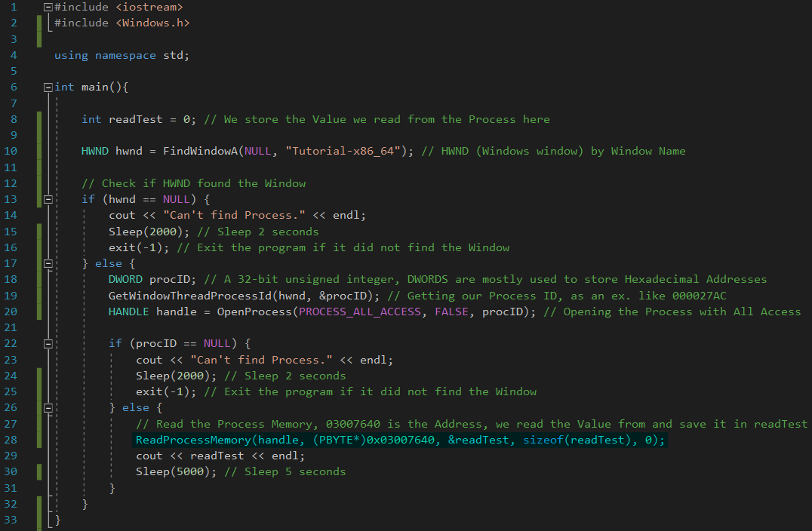
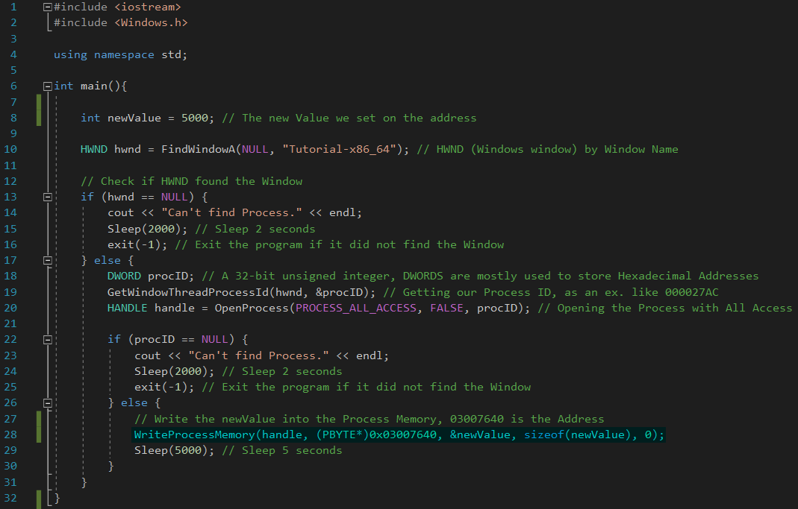

# 🔍 Simple Memory Reading Writing 🔧
🔍 Very Simple Template to read / write Process Memory with C++ 🔧

## 🔍 Read Process Memory (ReadProcessMemory) 🔍

```
#include <iostream>
#include <Windows.h>

using namespace std;

int main(){

	int readTest = 0; // We store the Value we read from the Process here

	HWND hwnd = FindWindowA(NULL, "Tutorial-x86_64"); // HWND (Windows window) by Window Name

	// Check if HWND found the Window
	if (hwnd == NULL) {
		cout << "Can't find Process." << endl;
		Sleep(2000); // Sleep 2 seconds
		exit(-1); // Exit the program if it did not find the Window
	} else {
		DWORD procID; // A 32-bit unsigned integer, DWORDS are mostly used to store Hexadecimal Addresses
		GetWindowThreadProcessId(hwnd, &procID); // Getting our Process ID, as an ex. like 000027AC
		HANDLE handle = OpenProcess(PROCESS_ALL_ACCESS, FALSE, procID); // Opening the Process with All Access

		if (procID == NULL) {
			cout << "Can't find Process." << endl;
			Sleep(2000); // Sleep 2 seconds
			exit(-1); // Exit the program if it did not find the Window
		} else {
			// Read the Process Memory, 03007640 is the Address, we read the Value from and save it in readTest
			ReadProcessMemory(handle, (PBYTE*)0x03007640, &readTest, sizeof(readTest), 0);
			cout << readTest << endl;
			Sleep(5000); // Sleep 5 seconds
		}
	}
}
```



## 🔧 Write into Process Memory (WriteProcessMemory) 🔧

```
#include <iostream>
#include <Windows.h>

using namespace std;

int main() {

	int newValue = 5000; // The new Value we set on the address

	HWND hwnd = FindWindowA(NULL, "Tutorial-x86_64"); // HWND (Windows window) by Window Name

	// Check if HWND found the Window
	if (hwnd == NULL) {
		cout << "Can't find Process." << endl;
		Sleep(2000); // Sleep 2 seconds
		exit(-1); // Exit the program if it did not find the Window
	}
	else {
		DWORD procID; // A 32-bit unsigned integer, DWORDS are mostly used to store Hexadecimal Addresses
		GetWindowThreadProcessId(hwnd, &procID); // Getting our Process ID, as an ex. like 000027AC
		HANDLE handle = OpenProcess(PROCESS_ALL_ACCESS, FALSE, procID); // Opening the Process with All Access

		if (procID == NULL) {
			cout << "Can't find Process." << endl;
			Sleep(2000); // Sleep 2 seconds
			exit(-1); // Exit the program if it did not find the Window
		}
		else {
			// Write the newValue into the Process Memory, 03007640 is the Address
			WriteProcessMemory(handle, (PBYTE*)0x03007640, &newValue, sizeof(newValue), 0);
			Sleep(5000); // Sleep 5 seconds
		}
	}
}
```


